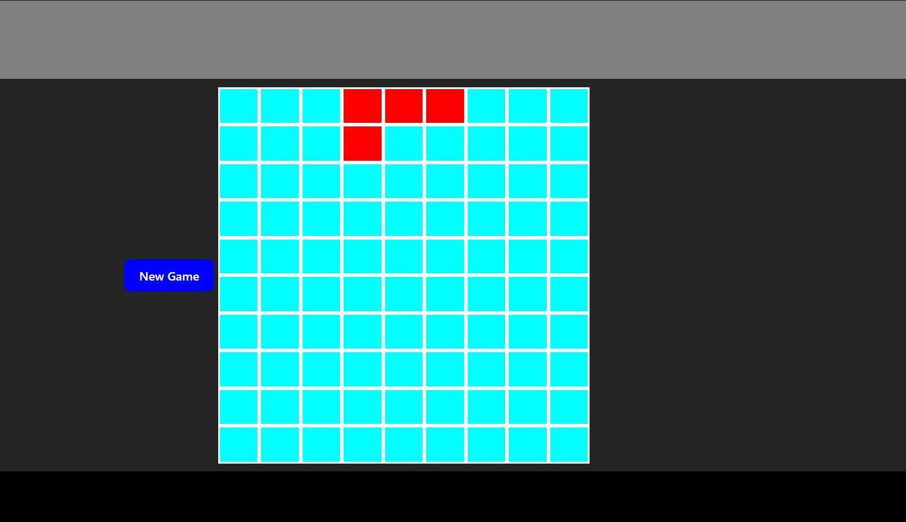

#<h1 align="center" style='color:red'><b>Tetris + React</b></h1>

---

<details>
  <summary>Content 📝</summary>
  <ol>
    <li><a href="#objetivo-🎯">Objetivo</a></li>
    <li><a href="#acerca-del-proyecto-🔎">Acerca del proyecto</a></li>
    <li><a href="#deploy-🚀">Deploy</a></li>
    <li><a href="#stack">Stack</a></li>
    <li><a href="#instalación-local">Instalación local</a></li>
    <li><a href="#vistas">Vistas</a></li>
    <li><a href="#futuras-features">Futuras features</a></li>
    <li><a href="#contribuciones">Contribuciones</a></li>
    <li><a href="#licencia">Licencia</a></li>
    <li><a href="#webgrafia">Webgrafia</a></li>
    <li><a href="#desarrollo">Desarrollo</a></li>
    <li><a href="#agradecimientos">Agradecimientos</a></li>
    <li><a href="#contacto">Contacto</a></li>
  </ol>
</details>

---

## Objetivo 🎯

---
Crear una versión propia del Tetris que me ayude a prácticar mis habilidades como desarrollador.

---

## Acerca del proyecto 🔎

---

Hace un tiempo me llego una prueba técnica que no fui capaz de superar, se me daba un tablero con piezas de Tetris, huecos en ese tablero y la pieza que iba a salir. Pedían un programa capaz de hacer que la pieza encajara de la manera más óptima en el hueco dejado. No fui capaz de resolverla.

Pero sin embargo, me ha ofrecido una perfecta oportunidad para prácticar, y que mejor forma que recrear el Tetris por mí mismo.   
  
---
## Deploy 🚀
---
<div align="center">
    <a href="https://master.d3axn9txrlwi1i.amplifyapp.com/"><strong>URL to Datapolo webpage  </strong></a>🚀🚀🚀
</div>

---

## Stack

---

<div align="center">
<a href="https://www.reactjs.com/">
    
</a>
<a href="https://reactrouter.com/en/main">
    
</a>
<a href="https://developer.mozilla.org/es/docs/Web/JavaScript">
    
</a>
<a href="https://www.adobe.com/es/products/photoshop/landpb.html?gclid=Cj0KCQjwsIejBhDOARIsANYqkD25rOS596fBY-rwSPIdUWW2E5eT4baf7l63Gv1aw2uMMv7nulEawBcaAuh8EALw_wcB&mv=search&s_kwcid=AL!3085!3!441887029672!e!!g!!adobe%20photoshop!1445901735!56657232416&mv=search&sdid=LZ32SYVR&ef_id=Cj0KCQjwsIejBhDOARIsANYqkD25rOS596fBY-rwSPIdUWW2E5eT4baf7l63Gv1aw2uMMv7nulEawBcaAuh8EALw_wcB:G:s&s_kwcid=AL!3085!3!441887029672!e!!g!!adobe%20photoshop!1445901735!56657232416&gad=1">
    
</a>
 </div>

---
## Instalación local
---
1. Clone the repository.
2. Command to install the dependences: ` $ npm install `
3. Command to run the aplication in local: ` $ npm run dev `
4. Follow the link to Local in your console.

---
## Vistas
---

Web view:

  

---
## Futuras features
---

[ ] Insertar una nueva pieza una vez la actual llega al inferior del tablero.
[ ] Realizar el movimiento automático hacía abajo de forma periódica.
[ ] Eliminar las filas que esten completadas.
[ ] Trasladar las filas cuadno una fila desaparezca.
[ ] Reducir el tiempo que tarda en moverse hacía abajo una ficha cada vez que desaparece una fila.
[ ] ...

---
## Contribuciones
---

Los consejos y advertencias son siempre bien recibidos. 

Puedes contribuir siguiendo estos pasos:

1. Abre un issue
2. Fork al repositorio
    - Crear una rama  
        ```
        $ git checkout -b feature/userName-newFeature
        ```
    - Commit con tus cambios 
        ```
        $ git commit -m 'feat: newFeature is this'
        ```
    - Push a tu rama
        ```
        $ git push origin feature/userName-newFeature
        ```
    - Abre un Pull-Request

---

## Licencia

---

This project is under the MIT license for Ignacio Furió José

---
## Webgrafia:
---

I got some support information from:
- practice repositories 
- official documentation:
  - React: https://es.react.dev/

---
## Desarrollo:
---

``` js
 const developer = "Ignacio Furió José";

 console.log("Developed by: " + Ignacio Furió José);
```  

---
## Agradecimientos:

---

A Brais Moure por su contenido, me inspira a seguir creciendo como desarrollador y experimentar por mi mismo.

- **Mouredev**  
  
    <a href="https://github.com/mouredev" target="_blank1"></a> 

Gracias también al apoyo recibido por amigs y familia, sin vosotros, esto no sería posible.


---

## Contacto

---
<a href = "mailto:bichoifj@gmail.com"></a>
<a href="https://www.linkedin.com/in/ignacio-furi%C3%B3-0a9010233/" target="_blank"></a> 
</p>
